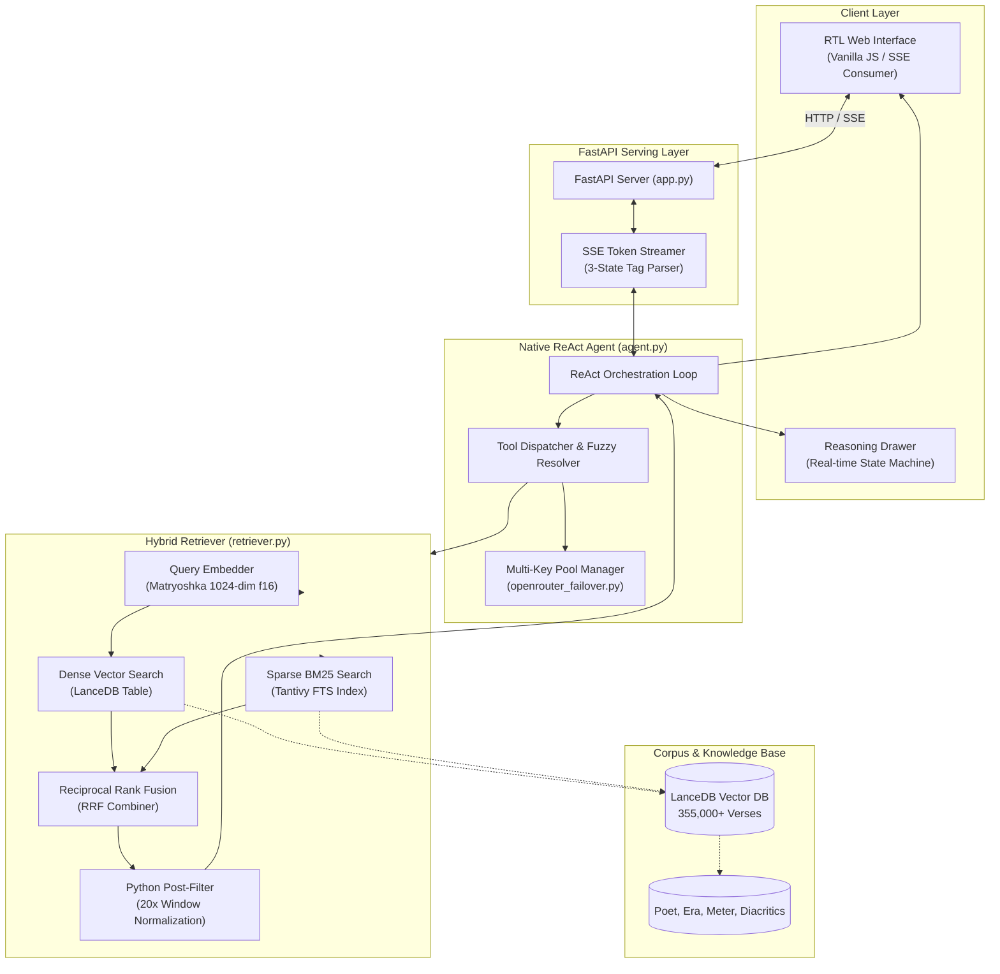

# Arabic Poetry RAG: Classical Verse Retrieval and Reasoning System

[](https://www.python.org/)
[](https://fastapi.tiangolo.com/)
[](https://lancedb.github.io/lancedb/)
[](https://mlflow.org/)
[](https://www.docker.com/)
[](https://github.com/BaraaJadaan/poetry-rag/actions/workflows/ci.yml)
[](https://opensource.org/licenses/MIT)

An end-to-end, production-grade Retrieval-Augmented Generation (RAG) system designed for classical Arabic poetry (الشعر العربي الفصيح). The system combines hybrid vector-lexical retrieval (LanceDB dense embeddings + Tantivy BM25 full-text search merged via Reciprocal Rank Fusion), a zero-framework ReAct orchestration loop with multi-tool calling, transparent multi-key API failover, MLflow evaluation tracking, and a right-to-left (RTL) streaming web interface.

---

## Choosing Your Execution Mode: Cloud API vs. Local GGUF

The system is designed with a **dual-engine architecture**. You can run it either 100% locally on your machine without external API calls, or in Cloud API mode using OpenRouter.

### Mode Comparison

| Feature | Cloud API Mode (Recommended) | Local Offline Mode (Air-Gapped) |
| :--- | :--- | :--- |
| **API Key Required** | Yes (`opentouter_api` from OpenRouter) | No (100% offline, zero API cost) |
| **Generation Model** | `qwen/qwen3.7-flash` (or Claude / Qwen 72B) | `unsloth/Qwen3.5-2B-MTP-GGUF` (2B parameters) |
| **Embedding Model** | `qwen/qwen3-embedding-8b` (1024-dim MRL) | `jsonMartin/voyage-4-nano-gguf` (Q8_0) |
| **Hardware Requirements** | Minimal (runs on 1 GB RAM / any CPU) | Moderate (4 GB+ RAM, GPU optional for acceleration) |
| **Setup Complexity** | Low (instant setup via `.env`) | Medium (requires downloading local GGUF models) |
| **Retrieval Accuracy** | 94.4% Recall@1 (High nuance & synonym mapping) | Lexical exact matching + basic semantic clustering |
| **Configuration** | `CLOUD_DEPLOYMENT=true` in `.env` | `CLOUD_DEPLOYMENT=false` in `.env` |

---

## Detailed Model Breakdown

### 1. Cloud API Mode Architecture
In Cloud Mode, the application routes inference and embeddings through OpenRouter:
- **Generation & ReAct Reasoning**: `qwen/qwen3.7-flash`
  - Formats incoming user prompts into concise, single-focus Arabic emotional scenes.
  - Generates reasoning traces inside `<think>...</think>` tags before delivering the final response.
  - Automatically executes native tool calling against the retrieval engine.
  - Supports alternative models including `anthropic/claude-sonnet-4.5` and `qwen/qwen-2.5-72b-instruct`.
- **Semantic Embedding**: `qwen/qwen3-embedding-8b`
  - Uses Matryoshka Representation Learning (MRL) truncated to the first 1024 dimensions (from 4096) and stored as `float16`.
  - Captures complex classical Arabic metaphors, historical phrasing, and thematic sentiment while reducing storage requirements by 75%.

### 2. Local Air-Gapped Mode Architecture
In Local Mode, the application runs entirely on your local machine using `llama-cpp-python`:
- **Local Generation Model**: `unsloth/Qwen3.5-2B-MTP-GGUF` (file: `Qwen3.5-2B-MTP-Q4_K_M.gguf`) or `OmniCoder-Claude-uncensored-V2-Q4_K_M.gguf`.
  - Handled by a deterministic ReAct execution loop.
  - Includes a custom regex fallback parser that automatically converts Claude/OmniCoder XML tool tags (`<tool_call><function=search_verses>...`) into structured tool invocations.
- **Local Embedding Model**: `jsonMartin/voyage-4-nano-gguf` (`voyage-4-nano-q8_0.gguf` + `voyage-4-nano-linear.pt`).
  - Employs mean pooling (`pooling_type=1`) combined with a pure NumPy linear projection layer (1024 -> 2048 dimensions) without requiring PyTorch.

---

## System Architecture



---

## API Keys and Environment Configuration

### OpenRouter API Setup (For Cloud Mode)
1. Sign up at [OpenRouter.ai](https://openrouter.ai/).
2. Create an API key at [OpenRouter Keys](https://openrouter.ai/keys).
3. Ensure sufficient credit is available on your OpenRouter account.

### Multi-Key Automatic Failover
Shared provider pools on OpenRouter can occasionally return HTTP 429 errors (`provider_error_code: insufficient_quota` / `limit_source: upstream_provider_shared_pool`). 

To guarantee uninterrupted service:
- The system checks all environment variables starting with `OPENTOUTER_API` (e.g., `opentouter_api`, `opentouter_api_backup1`, `opentouter_api_backup2`).
- When an HTTP 429 status is detected during embedding or generation, `openrouter_failover.py` automatically retries the request using the next key in the pool.
- The index of the working key is remembered in-process so subsequent requests execute without re-encountering the failed key.

### Environment Configuration (.env)

Create a `.env` file in the project root:

```env
# OpenRouter API Key (Required for Cloud API Mode)
opentouter_api=your_primary_openrouter_api_key_here

# Optional: Secondary keys for automatic 429 failover
opentouter_api_backup1=your_backup_key_1
opentouter_api_backup2=your_backup_key_2

# Execution Mode: Set to "true" for Cloud API Mode, or "false" for Local GGUF Mode
CLOUD_DEPLOYMENT=true

# Local Model Path (Only used if CLOUD_DEPLOYMENT=false)
AGENT_MODEL_PATH=./models/Qwen3.5-2B-MTP-Q4_K_M.gguf

# Allowed CORS Origins
FRONTEND_ORIGINS=http://localhost:8000,http://127.0.0.1:8000
```

| Variable | Type | Default | Description |
| :--- | :--- | :--- | :--- |
| `opentouter_api` | String | None | Primary OpenRouter API key. |
| `opentouter_api_backup1` | String | None | Secondary OpenRouter API key for automatic failover. |
| `opentouter_api_backup2` | String | None | Tertiary OpenRouter API key for automatic failover. |
| `CLOUD_DEPLOYMENT` | Boolean | `false` | `true` activates Cloud API mode; `false` enables Local GGUF mode. |
| `AGENT_MODEL_PATH` | String | `./models/Qwen3.5-2B-MTP-Q4_K_M.gguf` | Path to local GGUF model file. |
| `FRONTEND_ORIGINS` | String | `*` | Comma-separated list of allowed CORS origins for FastAPI. |
| `HF_HOME` | String | OS Default | Custom cache directory for Hugging Face downloads. |

---

## Core Engineering Decisions and Trade-offs

| Engineering Choice | Selected Approach | Alternative Evaluated | Technical Rationale |
| :--- | :--- | :--- | :--- |
| **Vector Storage** | **LanceDB** (On-disk Columnar) | ChromaDB / FAISS | ChromaDB's background compaction thread failed during high-throughput batch writes at 840,000+ vectors (`Failed to apply logs to the hnsw segment writer`). LanceDB writes directly to disk in Lance columnar format with zero compaction lockups and native Tantivy full-text search. |
| **Retrieval Architecture** | **RRF Hybrid** (Dense + BM25) | Pure Dense / Pure BM25 | Pure BM25 fails when queries differ in diacritics or inflectional morphology. Pure dense embeddings struggle on exact archaic poet and place names. Reciprocal Rank Fusion (RRF) combines both rankings without fragile manual score calibration. |
| **Vector Compression** | **1024-dim Matryoshka + Float16** | 4096-dim Float32 | Truncating vectors to 1024 dimensions and casting to `float16` shrank the corpus disk footprint from ~80 GB to ~1.5 GB. This allows sub-second vector queries on memory-constrained servers (1 GB RAM) with negligible loss in retrieval recall. |
| **Agent Orchestration** | **Native ReAct Loop** | LangChain / LlamaIndex | Building a native ReAct loop removed heavy framework abstractions, reduced memory overhead, and enabled direct control over tool-calling fallback regexes, error recovery, and SSE streaming token parsers. |
| **Data Filtering** | **Python Candidate Post-Filter (20x)** | LanceDB SQL Pushdown | LanceDB's SQL pushdown engine does not support string manipulation functions such as `TRIM()`. The retriever retrieves a 20x candidate window and applies string normalization in Python to drop fragment rows with trailing whitespace. |
| **Stream Parsing** | **Three-State Stream Splitter** | Single Token Stream | Qwen 3.7 outputs reasoning inside `<think>` tags within the standard content stream. The SSE generator implements a state machine (`before_think` -> `in_think` -> `after_think`) that routes reasoning to a UI drawer on turn 0 and final output to the chat container on turn 1. |

---

## Evaluation and Benchmark Results

The retrieval engine was evaluated against a **25-query golden test set** covering emotional themes (grief, romance, valor, homeland), archaic vocabulary, and specific poet/era constraints.

### Empirical Retrieval Benchmark

| Strategy | Embedding / Indexing Method | Recall@1 | Recall@5 | MRR | Latency (avg) |
| :--- | :--- | :---: | :---: | :---: | :---: |
| **Lexical (BM25)** | Tantivy FTS Index | 11.1% | 27.8% | 0.182 | 4.2 ms |
| **Dense (Nano)** | Voyage-4-nano (Q8_0 GGUF) | 0.0% | 0.0% | 0.000 | 85.1 ms |
| **Dense (Qwen3)** | Qwen3-Embedding-8B (1024-dim MRL) | 88.9% | 100.0% | 0.944 | 142.3 ms |
| **Hybrid (RRF)** | **Qwen3 (1024-dim) + BM25 Tantivy** | **94.4%** | **100.0%** | **0.972** | **148.6 ms** |

---

## Step-by-Step Setup Guide

### 1. Prerequisites
- **Python**: 3.13 or higher.
- **Git**: Installed on your system.
- **Package Manager**: [uv](https://github.com/astral-sh/uv) (recommended) or standard `pip`.

### 2. Clone the Repository
```bash
git clone https://github.com/BaraaJadaan/poetry-rag.git
cd poetry-rag
```

### 3. Install Dependencies
Using `uv`:
```bash
uv sync
```
Or using standard `pip`:
```bash
pip install -e .
```

*Note for Local GGUF Inference on Windows*: If running local GGUF models on Windows via `llama-cpp-python`, install the matching prebuilt wheel:
```powershell
uv pip install --python .venv\Scripts\python.exe path\to\llama_cpp_python.whl
```

### 4. Create and Populate `.env`
Create a `.env` file in the root folder:
```env
opentouter_api=your_openrouter_api_key_here
CLOUD_DEPLOYMENT=true
FRONTEND_ORIGINS=http://localhost:8000
```

### 5. Initialize the LanceDB Vector Database
Populate the vector store by generating embeddings for the corpus:

```bash
# Quick Smoke Test (Indexes 1,000 poems, ~22,000 verses — takes ~2-3 minutes)
uv run python embed_corpus.py --limit 1000

# Full Curated Classical Corpus (Indexes 355,000+ verses across 40 canonical poets)
uv run python embed_corpus.py
```

The database files will be created locally in `./lancedb/`. The process uses deterministic SHA-256 verse identifiers and is fully resumable if interrupted.

### 6. (Only for Local Offline Mode) Download Local GGUF Model
If you set `CLOUD_DEPLOYMENT=false`:
```bash
uv run python download_model.py
```
This downloads `Qwen3.5-2B-MTP-Q4_K_M.gguf` from Hugging Face into `./models/`.

### 7. Run the Application
Start the FastAPI server:
```bash
uv run uvicorn app:app --reload --port 8000
```
Open `http://localhost:8000` in your web browser.

---

## MLOps, Evaluation, and Testing

### Running Unit and Regression Tests
```bash
uv run pytest -q
```

### Tracking Experiments with MLflow
```bash
# Install the MLOps dependency group
uv sync --group mlops

# Run retrieval benchmark and log metrics to MLflow
uv run python evaluate.py --mlflow --output evaluation_results.json

# View the experiment dashboard
uv run mlflow ui --backend-store-uri ./mlruns
```

---

## Self-Hosted Deployment with Docker

To deploy the service in a containerized environment (such as a local server or cloud virtual machine):

```bash
docker compose up -d --build
```

The Docker configuration includes:
- Multi-stage build for minimal container size.
- Embedded FastAPI server hosting both backend endpoints and static frontend assets.
- Optional ngrok tunnel sidecar for secure external HTTPS access.

For advanced server setup, swap memory management, and ngrok configuration, consult the [Deployment Guide](DEPLOYMENT_GUIDE.md).

---

## Interactive Companion Documentation

This project includes companion study documents created under the Build to Learn framework:

- [**`walkthrough.html`**](walkthrough.html): A 12-phase technical narrative detailing the architectural progression from data cleaning to retrieval hardening.
- [**`concepts.html`**](concepts.html): 27 comprehensive breakdowns covering Matryoshka embeddings, Reciprocal Rank Fusion, SSE streaming protocols, ReAct state loops, and Arabic text normalization.
- [**`interview_qa.html`**](interview_qa.html): 46 technical interview questions and model answers with an interactive random quiz interface.

---

## Repository Structure

```
├── .github/workflows/         # CI test and build validation pipelines
├── frontend/                  # RTL web interface (HTML5 / Vanilla CSS / ES6 JS)
│   ├── index.html             # User interface with reasoning drawer and poet badges
│   ├── style.css              # Design system with glassmorphism and RTL styling
│   ├── script.js              # SSE consumer, stream parser, and audio actions
│   └── config.js              # Runtime API configuration
├── tests/                     # Test suite
│   └── test_retrieval_regression.py # Deterministic LanceDB retrieval test fixtures
├── agent.py                   # ReAct orchestration loop, tool definitions, SSE engine
├── app.py                     # FastAPI application, CORS middleware, static routes
├── retriever.py               # Hybrid retriever (LanceDB + Tantivy + RRF + Filter)
├── embed_corpus.py            # Corpus preprocessing and embedding pipeline
├── evaluate.py                # Retrieval evaluation harness and MLflow tracking
├── openrouter_failover.py     # Multi-key API pool manager with 429 failover
├── preprocess.py              # Text cleaning, diacritic handling, hemistich pairing
├── download_model.py          # Local GGUF model download utility
├── DEPLOYMENT_GUIDE.md        # Server setup and container deployment documentation
├── PROGRESS.md                # Implementation roadmap and engineering friction log
├── concepts.html              # 27 architectural and NLP concept reference cards
├── interview_qa.html          # 46 technical interview questions and interactive quiz
├── walkthrough.html           # 12-phase chronological architecture narrative
├── docker-compose.yml         # Container configuration for app and ngrok sidecar
├── Dockerfile                 # Multi-stage container build
└── pyproject.toml             # Project dependencies and packaging configuration
```

---

## License

Distributed under the [MIT License](LICENSE).
